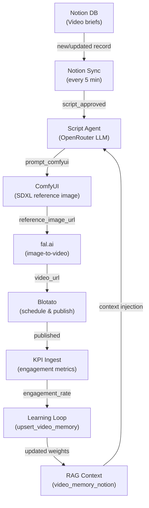

# MOS v4.1-RC1 — Architecture

## Pipeline Overview

## Three Operational Modes

### Novice
- Use ComfyUI + fal.ai for full AI generation (image → video)
- n8n workflows handle all automation end-to-end
- No code required — configure via `.env` and Notion

### Standard
- Bring your own reference images (skip ComfyUI)
- Plug in any fal.ai-supported model via `FAL_VIDEO_MODEL`
- Customize the script agent prompt in `prompts/video-script-agent.md`

### Expert
- Fork the migrations and add custom tables/RPCs
- Wire additional n8n workflows using the established patterns
- Contribute new model adapters in `MOS-v4.1-Fal-Submit.json`

## Tech Stack

| Layer | Technology |
|---|---|
| Database | PostgreSQL 17 via Supabase |
| Orchestration | n8n (self-hosted or cloud) |
| Image generation | ComfyUI + SDXL base |
| Video generation | fal.ai (Kling, Minimax, Luma) |
| Script generation | OpenRouter (Claude, GPT-4, etc.) |
| Publishing | Blotato |
| Content source | Notion |
| Storage | Supabase Storage (`mos-images` bucket) |

## Key Design Decisions

- **Supabase as pipeline bus**: every state transition is recorded via Postgres RPCs, making the pipeline auditable and restartable
- **Dual completion path** for fal.ai: webhook (fast path) + sweeper every 30 min (safety net), both idempotent
- **Processing locks** with TTL prevent concurrent duplicate jobs per client
- **Dead letter + exponential backoff**: failed jobs retry 3× before escalating to `dead_letter` status
- **Learning Loop closes the feedback cycle**: KPI data updates `video_memory_notion` weights, improving future script generation
